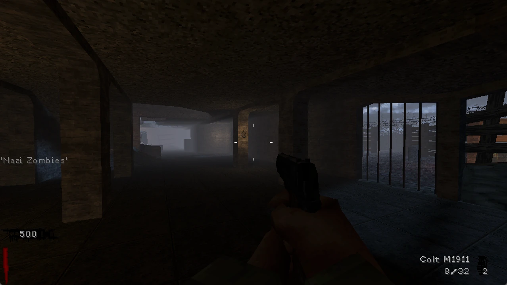
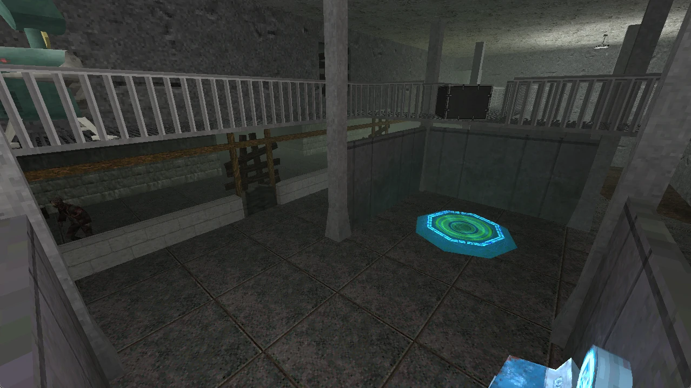
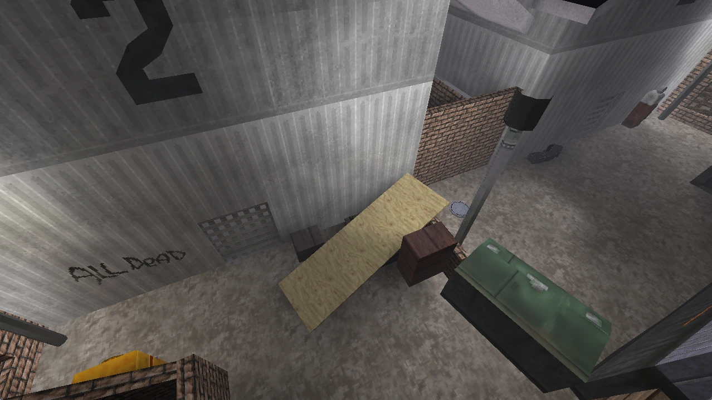
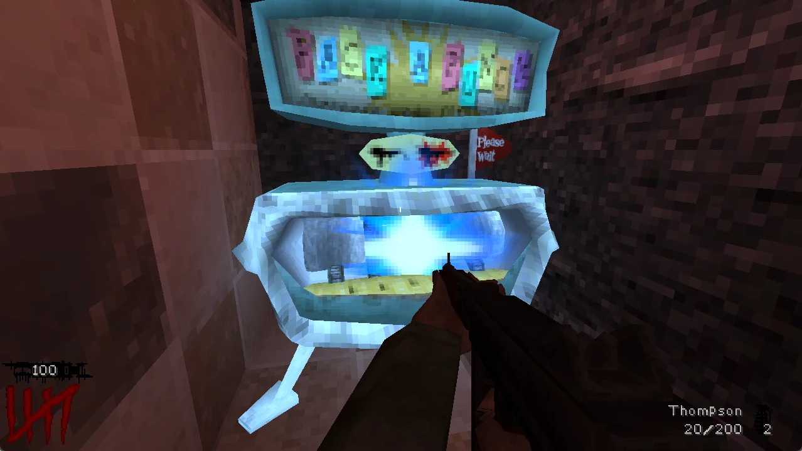

% Landing - NZ:P Documentation
# Nazi Zombies: Portable Documentation

## About

Welcome to the official Documentation landing page for Nazi Zombies: Portable, a _Call of Duty: Zombies_ remake running on several modified forks of the _Quake_ (1996) engine, licensed under the [GNU General Public License version 2](https://www.gnu.org/licenses/old-licenses/gpl-2.0.en.html), with project assets under [CC-BY-SA 4.0](https://creativecommons.org/licenses/by-sa/4.0/deed.en). The following platforms are supported:

- Windows (2000 and above, x86 and x86_64)
- Linux (x86, x86_64, arm, arm64, armhf)
- PlayStation Portable (all models)
- PlayStation VITA
- Nintendo 3DS (all models)
- Nintendo Switch

This documentation is not designed to cover basic gameplay foundations such as the Power-Up system, what Perk-A-Cola machines are, etc., as those are bases covered by the official [_Call of Duty_ Wiki](https://callofduty.fandom.com/wiki/Call_of_Duty_Wiki). Nazi Zombies: Portable goes to great efforts to achieve parity with it's gameplay features in such a way that makes content on said wiki valid and applicable to this project as well.

All documentation and media hosted is licensed under [CC-BY-SA 4.0](https://creativecommons.org/licenses/by-sa/4.0/deed.en), with no exclusions or exceptions.

## Game Screenshots

## Downloading Nazi Zombies: Portable

At this current moment, no marked-stable builds of Nazi Zombies: Portable are made available. Instead, nightly builds on all platforms are released via GitHub releases, accessible [here](https://github.com/nzp-team/nzportable/releases/latest). This link will always take you to the latest release, identifiable via the build date in the release title.

## [Downloading & Installing Maps in Nazi Zombies: Portable](../mapping/downloading-and-installing-maps.md)

## Core Documentation

Core documents contain information about Nazi Zombies: Portable's internal design. They may not be specifically relevant to custom content creators, though overlap will be present for map features that interact with NZ:P's QuakeC or for specialty features.

- [Dedicated Server](../internal/dedicated-server.md)
- [Weapon IDs](../internal/weapon-ids.md)

## Mapping & Modding Documentation

These documents are relevant for level creators who wish to create content for Nazi Zombies: Portable. These documents assume you have basic knowledge of [mapping for Quake](https://www.youtube.com/playlist?list=PLgDKRPte5Y0AZ_K_PZbWbgBAEt5xf74aE), as well as [TrenchBroom](https://trenchbroom.github.io/) knowledge. Nazi Zombies: Portable also supports Valve HAMMER based mapping software via a separate FGD.
Documentation and by extension headers/categories are a work in progress.

### General
- [TrenchBroom Set-Up](../mapping/trenchbroom-setup.md)
- [External References](../mapping/external-references.md)
- [Customizing Mystery Box Weapons](../mapping/mbox2-format.md)
- [Advanced Model Exporting](../mapping/model-exporting.md)
- [Model Alpha Transparency](../mapping/alpha-transparency.md)
- [Fog](../mapping/fog.md)

### Map Entities
- [Barricades](../mapping/barricades.md)
- [Explosive Barrels](../mapping/explosive-barrels.md)
- [Player Spawn Points](../mapping/player-spawns.md)
- [Wall Weapons](../mapping/wall-weapons.md)
- [Zombie Horde Points](../mapping/zombie-horde-points.md)
- [Random Perk-A-Cola Machines](../mapping/random-perks.md)

### Map Triggers
- [trigger_setfire](../mapping/trigger_setfire.md)
- [trigger_awardpoints](../mapping/trigger_awardpoints.md)
- [trigger_interact](../mapping/trigger_interact.md)
- [trigger_atroundend](../mapping/trigger_atroundend.md)
