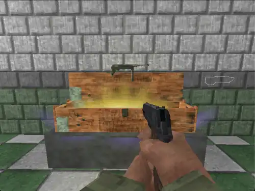
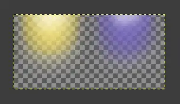
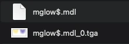

% Model Alpha Transparency - NZ:P Mapping Documentation
# Model Alpha Transparency

## Introduction

_Nazi Zombies: Portable_ has it's own unique method of enabling alpha blending for models, equivalent to the `GL_SRC_ALPHA GL_ONE_MINUS_SRC_ALPHA` OpenGL blend mode. This process is supported by all platforms and the set up is identical for all of them.

## Texture Format

`.TGA` formated textures are the only ones supported for this method, and they can safely be exported as 32 bit RGBA.

## Naming Convention

The texture follows the same naming convention as standard Quake external textures. That being `model/path/your_model.mdl_<skin_index>.tga`. However, the model name itself has a unique identifier. The last character of the name (*before* the file extension) must be `$`. What this does internally is redirect the model renderer to a different pipeline that sets the given blend modes on non-FTE, and creates a Quake III shader inside of FTE in the `scripts/` path on first launch.