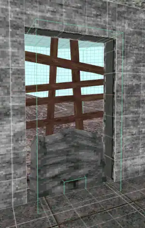
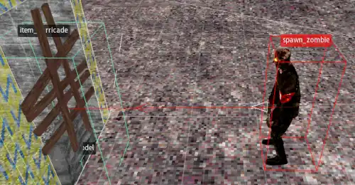
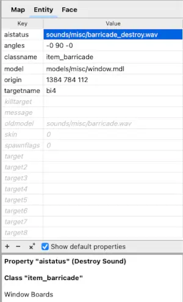

% Barricades - NZ:P Mapping Documentation
# Barricades

__NOTE: This guide uses the terms "level" and "map" interchangeably.__

## Introduction



Barricades in Nazi Zombies: Portable are points of entry for Zombies. They can consist of six "planks" maximum and are destroyed by AI before becoming an obstacle that can be hopped over until repaired by the player (if applicable). They are placed via the `item_barricade` entity.

## Pathing to Barricades

Zombies, when outside, follow a creator-determined path via `target` linking. They will walk directly towards their targets, with the end goal being to reach a barricade.

### Simple Paths



For paths where a Zombie spawn point is directly in the view of a barricade, and the barricade can be reached via a straight line, the level creator can make the barricade directly `target`ed by the spawn point.

### Complex Paths


For paths where the Zombie is expected to travel in a complicated route (e.g., around a bend), `path_corner` entities can be used the same way as _Quake_ to chain `target`s together and create a winding route.

## Cosmetic Feature Set

### Sounds and Model



Like other entities, a custom `model` and `skin` can be applied to barricades to change their visuals. The model provided must have a matching frame number as the existing barricade to be usable, and it is recommended to ensure the custom barricade model has the same amount of "planks" (six) to preserve the visual feedback for the player about a barricade's state.

Additionally, custom sounds for the `destroy` and `repair` state can be applied:

```
oldmodel : Rebuild Sound
aistatus : Destroy Sound
```

## Functional Feature Set

### Spawnflags

Barricades feature a single spawnflag, `No Boards/Not Repairable` (`1`), if your barricade serves as strictly a hop-able entry point that can not be repaired or concealed by the player.

### Starting and Maximum Board Count

Level creators have the ability to determine how many boards on a barricade are present on initial map load (`health` key), as well as how many of these boards are actually repairable (`health_delay` key). These are both limited to `6` boards maximum. To not conflict with levels created before the introduction of this feature (where the `health` key is not defined), creators must set starting number to `-1` in order to achieve the effect of a barricade being completely unrepaired on game start. This does not apply to maximum count, where `0` is valid.

These two values are not linked, meaning, having a starting board number greater than maximum is acceptable. This may be useful for level creators that want barricades to be a one-time use, as an example.