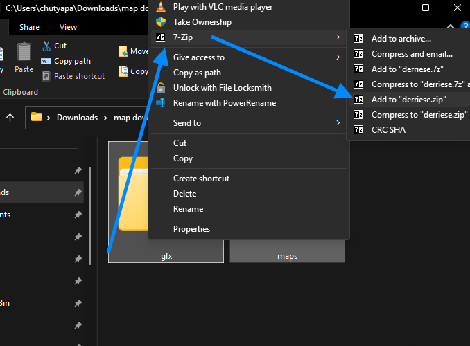
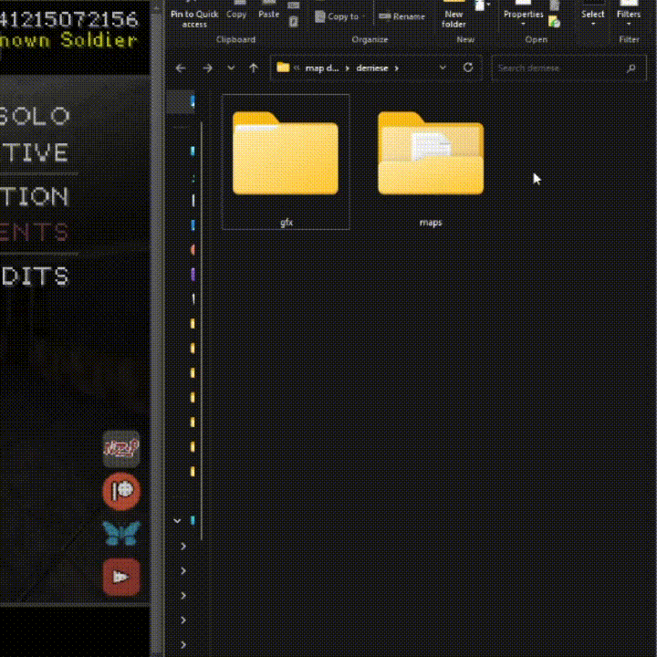

% Downloading & Installing Maps on Web, PC & Consoles - Downloading & Installing Maps in Nazi Zombies: Portable


# Downloading Maps

[Download a map from this page](https://github.com/nzp-team/nzportable/discussions/categories/map-releases){target="_blank"}


# Installing Maps on PC & Consoles

### Extracting 
Extract the map to a folder.


- **Make sure its in this layout.**
```
├── derriese (custom map extracted folder)
│   ├── gfx
│   │   ├── env
│   │   │   └── CloudyNightSky.png
│   │   ├── lscreen
│   │   │   └── derriese.png
│   └── maps
│       ├── derriese.bsp
│       ├── derriese.txt
│       └── derriese.way
```

#### Installing
Simply copy the contents of this extracted folder the game's `nzp` folder.


# Installing Maps on Web


 - [Install 7-zip if you are using Windows](https://www.7-zip.org/){target="_blank"} **(REQUIRED)**


### Extracting

Extract the map to a folder.


- **Make sure its in this layout.**
```
├── derriese (custom map extracted folder)
│   ├── gfx
│   │   ├── env
│   │   │   └── CloudyNightSky.png
│   │   ├── lscreen
│   │   │   └── derriese.png
│   └── maps
│       ├── derriese.bsp
│       ├── derriese.txt
│       └── derriese.way
```


### Zipping

Then select the map folder along with any other folders inside the extracted folder and compress it to `.zip`


for example:



Then we need to rename this new `.zip` to `.pk3` 

### Installation

Drag and Drop the .pk3 file into the game. 

Then reload the page afterwards, and the map will show up in user maps

### Video Demonstration




