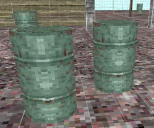

% Explosive Barrels - NZ:P Mapping Documentation
# Explosive Barrels

__NOTE: This guide uses the terms "level" and "map" interchangeably.__

## Introduction

Explosive Barrels are entities available in Nazi Zombies: Portable that act as passive defenses. Placed into a map via the `explosive_barrel` entity, they can be damaged by players to trigger an explosion, that can also be chain-reacted with other barrels in the area.

## Functionality

Upon contact, explosive barrels have health depleted like any other damage-able object. Once it's internal health is at or below zero, the barrel will explode. Where the barrels differ, however, is any damage dealt will begin an internal timer to automatically deplete it's health over time. This makes the barrel effectively serve as a ticking timebomb. The algorithm for automatic health depletion is `10 + (rint((random() * 10)))`. This calculation occurs once every one second. Barrels can still have their health depleted by the player while in this state.

## Feature Set

Barrels, when exploded, will fire `target`s. This feature is what is responsible for _Nacht der Untoten_'s secret song triggering after destroying all that are present in the level. Custom `models` and `skins` can also be provided like most other entities present in Nazi Zombies: Portable. Barrels can also be provided with a custom `health` value. If none are set, the default value of `300` is used.