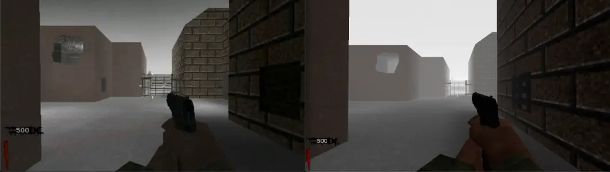

% Fog - NZ:P Mapping Documentation
# Fog

## Introduction



_Nazi Zombies: Portable_ uses it's own 5-parameter, linear fog system. This was originally conceived this way as the PlayStation Portable's hardware fog is *linear* and not *exponential* as is traditional for Quake and OpenGL itself. The Nintendo 3DS also adheres to this standard thanks to [picaGL](https://github.com/masterfeizz/picaGL/tree/revamp)'s linear LUT fog. Other platforms manipulate these fog values to approximate them into standard `exp2` fog modes. Exponential fog is significantly less granular and as a result this approximation will never be spot-on. 

## Parameters

```
usage:
    fog (start) (end) (red) (green) (blue)
```
*Excerpt from `fog` command in the console.*

When defining fog, you can provide a `start` and `end` distance, in units, of the fog "wall" that appears. The distance between `start` and `end` will impact intensity, and of course, the farther away `start` is from zero, the more visibility you have before the fog begins.

You can change the color of the fog given individual `red`, `green`, and `blue` color values. These values range from `0`-`100`, with `100` being maximum intensity. Both pure black fog with `0 0 0` and pure white fog with `100 100 100` are supported.

As an example, below is the fog output for *Nacht der Untoten*:

```
current values:
    "start" is "240"
    "end" is "1550"
    "red" is "54"
    "green" is "55"
    "blue" is "59"
```

## Translation

### Linear to Exponential

Platforms that do not support linear fog will algorithmically approximate a decent exponential fog density to use instead. The formula is as follows:

```
fog_density_gl = ((fog_start / fog_end)/3.5f)
```

### Exponential to Linear

FTE will still fallback to old `exp2` fog behaviors if provided them, however all other platforms will ignore fog if any of it's provided values are less than zero. This is intended behavior.