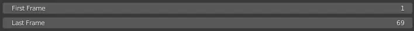
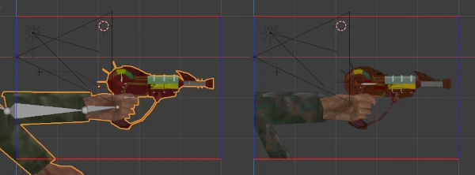
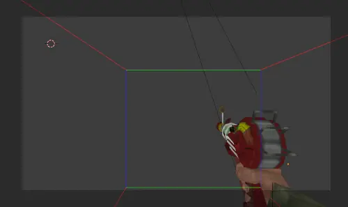

% Advanced Model Exporting - NZ:P Mapping Documentation
# Advanced Model Exporting

__NOTE: This is not a guide for learning basic Blender or _Quake_ `.MDL` exporting concepts.__

## Introduction

Nazi Zombies: Portable uses the standard _Quake_ `.MDL` format for most of its props and other meshes. Specific to view models, however, it utilizes a special fork of the common [io_mesh_qfmdl](https://github.com/robrohan/blender_ie_quake_mdl) Blender export plugin, adapted to better support [Blender 2.9`X`](https://download.blender.org/release/Blender2.93/) and contain features to mitigate vertex swimming. That forked export plugin can be found [here](https://github.com/nzp-team/tools/tree/main/io_mesh_qfmdl_blubs).

## Features

### "First Frame" & "Last Frame"

Contrary to the [vanilla](https://github.com/robrohan/blender_ie_quake_mdl) export plugin's usage of the playhead on the Blender timeline for frame selection, NZ:P's fork utilizes `Properties` menu entries for determining the start and ending frames to be baked into the resulting `.MDL`. This is particularly useful for wanting to export precise chunks of animation data.

### View Model "Bounding Box"

The `MDL Mins` and `MDL Maxs` properties define a minimum and maximum region for vertices to cross over. The intended benefit of this is to only warp/swim vertices to their max point of camera visibility in order to preserve fine details such as weapon iron sights. Enabling `Show MDL bounding box` will give you a visual representation of this box to use as reference.

It is important to consider that bounding boxes need determined based on expected view model field of view. It is recommended to set up a Blender camera with the intended field of view and set it as active to get a live preview of how well your bounding box accomodates every frame you are intending to export.

