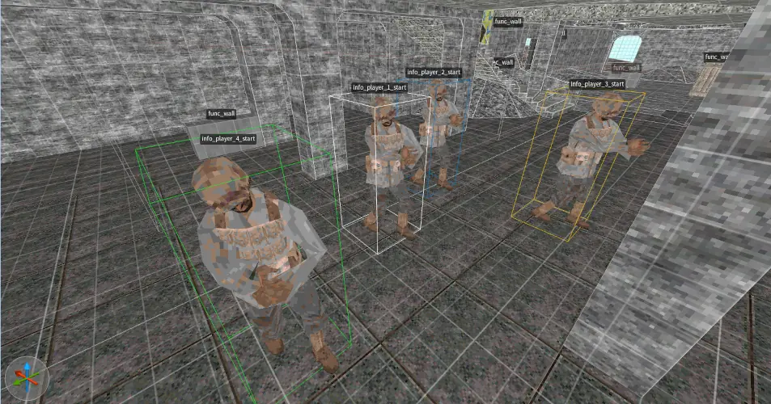
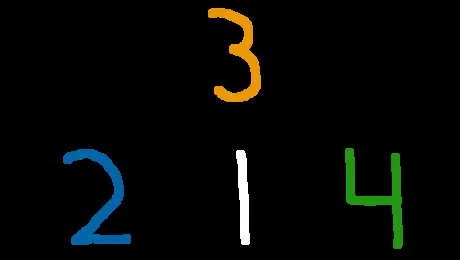
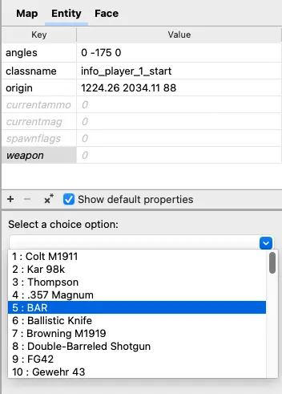
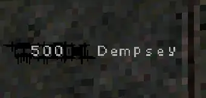

% Player Spawn Points - NZ:P Mapping Documentation
# Player Spawn Points

__NOTE: This guide uses the terms "level" and "map" interchangeably.__

## Introduction

Nazi Zombies: Portable expands on _Quake_'s foundation for Player Spawn entities (`info_player_*`) to allow for greater creator control over content, and to accomodate the four player co-operative nature of _Zombies_ gameplay. It does this by replacing the legacy `info_player_start` and similar entities with four distinct spawn point entities per player:

```
info_player_1_spawn - Player 1's Spawn, often assigned as "'Tank' Dempsey".
info_player_2_spawn - Player 2's Spawn, often assigned as "Nikolai Belinski".
info_player_3_spawn - Player 3's Spawn, often assigned as "Takeo Masaki".
info_player_4_spawn - Player 4's Spawn, often assigned as "Edward Richtofen".
```

## Ideal Spawn Point Conditions



It is important to consider the surroundings of any given potential spawn point location. Spawn locations must not be inside of any geometry, and it is recommended to not place them inside of any other entities your level may contain. Spawn points must also be reasonably spaced from one another, not cramped together in a small space -- this ensures any AFK players are not blocking others from interacting with their environment when gameplay begins.



_Call of Duty: Zombies_ often follows a strict order with spawn point locations, player one representing the "center" with players two, three, and four surrounding them. __This is not a required attribute__ to be met when designing levels and placing spawn points.

## Features

### Customizing Starting Weapon Loadouts

Nazi Zombies: Portable allows level creators to customize all four player's starting weapons and their ammunition amount individually. This is done via three distinct entitiy fields:

```
weapon : Starting Weapon
currentmag : Starting Magazine
currentammo : Starting Reserve Ammunition
```

If nothing is provided for `weapon`, the default loadout is applied (A Colt M1911, with 8 rounds in the magazine and 32 in the reserve).



### Specifying Character Names



Using the `name` key, level creators can specify the name for the Spawn Point's designated Character. There is a 16 character limit associated with this. Upon spawning, the client will have their Character's name displayed on the HUD to the right of their Score before fading away.

### Targeting

Upon a client spawning, standard Quake `target`s are fired by the spawn point. This, as an example, can be used to only activate specific AI spawn points on a section of the level, in the same vein as *Verrückt*. It is important to note that this is also activated upon *respawn*, so it may be wise to attach the spawn point to a `trigger_relay` set to activate only once, if you do not want your `target`s activated beyond game start/client join.

## Backwards Compatibility with Legacy Maps

Levels created before the implementation of features showcased here are still fully supported by Nazi Zombies: Portable. This includes maps that use _Quake_'s standard `info_player_start` entity and ones that used NZ:P's previous-and-primitive co-operative `info_player_tank`, `info_player_doctor`, etc. entities.

If a level only features less than four spawn point entities, NZ:P will algorithmically generate the other necessary points. It will use Player 1 as a starting origin, and attempt to generate other spawns in the same preferred order as _Call of Duty_ (see [Ideal Spawn Point Conditions](#ideal-spawn-point-conditions)). It makes 12 total attempts to do so with three different distances between Player 1's spawn. If all of these fail, the additional spawn points will appear in the same location as Player 1.