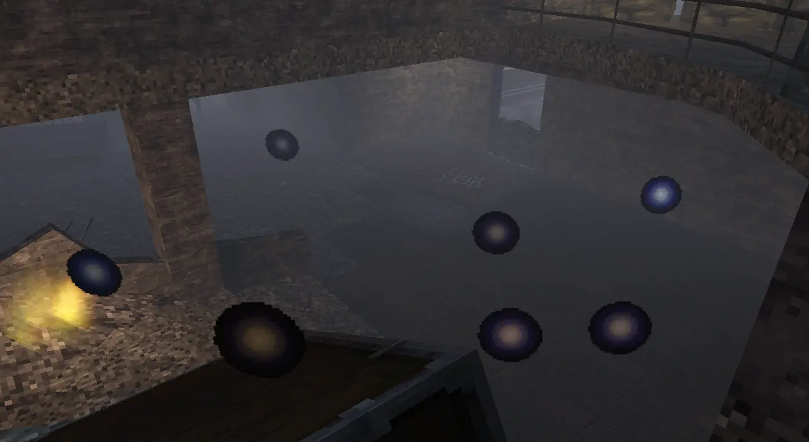
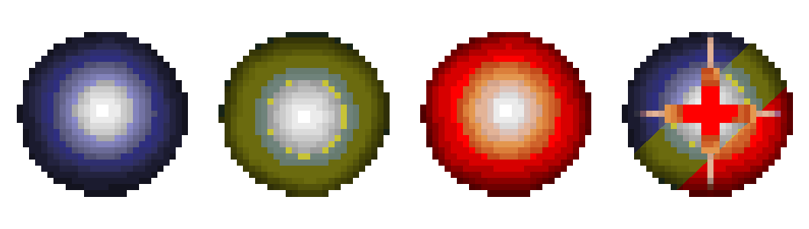
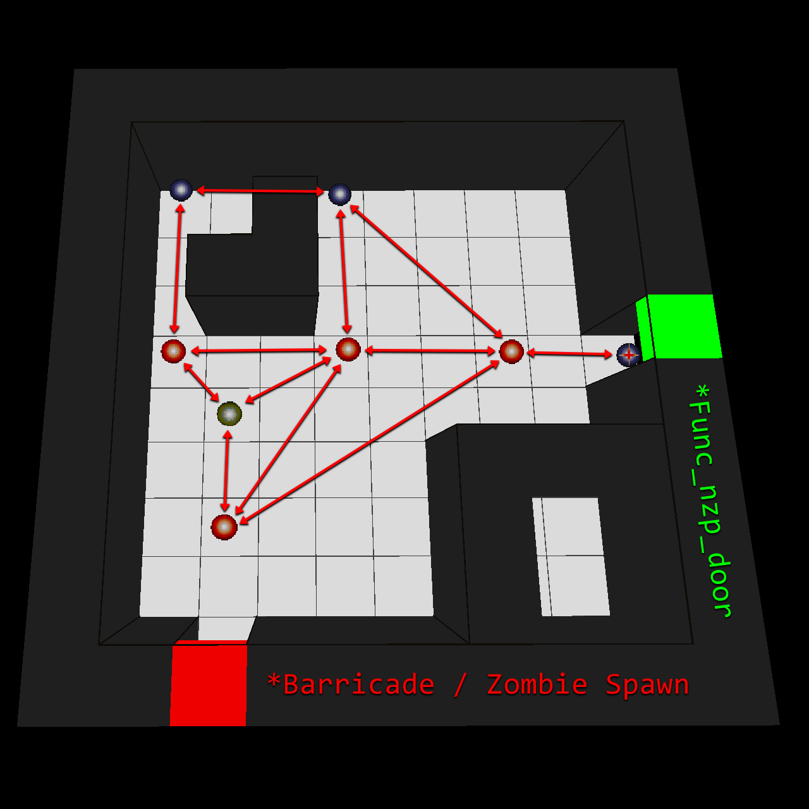

% Waypointing - NZ:P Mapping Documentation
# Waypointing

## Introduction

_Nazi Zombies: Portable_ makes use of a waypointing system to define nodes that zombies may path between. This allows for a fairly simple and intuitive, albeit limited, way to allow mappers to create custom pathfinding for their maps.

Waypoints can be edited directly in-game via the waypoint editing mode, foregoing the need to recompile the map when creating or adjusting waypoints. This mode can be accessed via the command `waypoint_mode 1` in the console.
Saving a set of waypoints via this mode will generate a `.way` file within the maps folder of NZ:P; a plain-text file containing data for each node.

## Interacting with Waypoints

| Actions | Keybinding | Description |
|---|---|---| 
| Create | Fire Weapon | Creates a default (blue) waypoint node at the players position. | 
| Select | Interact | Selects waypoint node currently being aimed at. | 
| Link | Aim Down Sights | Link selected (yellow) node to aimed at default (blue) node. | 
| Remove | Melee | Deletes current selected (yellow) node. | 
| Move | Next Weapon | Move current selected (yellow) node to player position. | 
| Create Special | Reload | Converts selected (yellow) node to a special node. Must be adjacent to a valid `func_nzp_door`. | 

## Special Waypoints

Special Waypoint nodes are used in conjunction with a valid `func_nzp_door` to prevent zombies from attempting to path through currently closed doors.

A valid `func_nzp_door` requires an ID to be set in the `wayTarget` entity field.

## Pathing Behaviour

Zombies will move along a path dictated by the mapper through connected waypoint nodes until they are within sight range to path to a player on their own (Where "Sight" is dictated by both the zombies shins and forehead being able to see the player).

When zombies reacquire a path to the player (Whether that be after hopping a barricade post-spawn, or in attempt to find the player after they have teleported outside and back into the map.), 
they will do so via the closest waypoint node to them. This is also important to consider in maps with verticality, as the nearest node to the zombie may in fact be above or below
them - causing them to get stuck.

