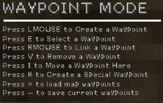

% Waypointing - NZ:P Mapping Documentation
# Waypointing

## Introduction

_Nazi Zombies: Portable_ makes use of a waypointing system to define nodes that zombies may path between. This allows for a fairly simple and intuitive, albeit limited, way to allow mappers to create custom pathfinding for their maps.

Waypoints can be edited directly in-game via the waypoint editing mode, foregoing the need to recompile the map when creating or adjusting waypoints. This mode can be accessed via the command `waypoint_mode 1` in the console.
Saving a set of waypoints via this mode will generate a `.way` file within the maps folder of NZ:P; a plain-text file containing data for each node.

## Interacting with Waypoints

