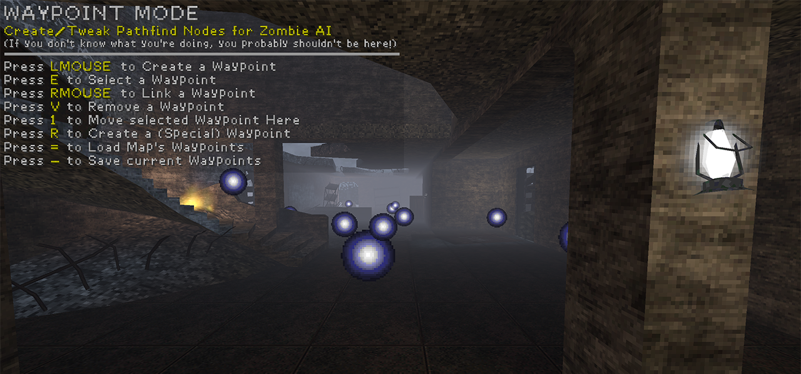

% Waypointing - NZ:P Mapping Documentation
# Waypointing

## Introduction

_Nazi Zombies: Portable_ makes use of a waypointing system to define nodes that zombies may path between. This allows for a fairly simple and intuitive, albeit limited, way to allow mappers to create custom pathfinding for their maps.

Waypoints are edited directly in-game via a special Waypoint Mode, as opposed to creating them in the map editor. This mode can be accessed via `waypoint_mode` cvar.
Saving a set of waypoints via this mode will generate a `.way` file within the maps folder of NZ:P, matching the original map file name. This `.way` file must be supplied alongside the original map file when sharing maps.

## .way Files

Due to `.way` files being plain-text, they can be opened in any text editor. Doing so will reveal the following data structure:

| Data Identifier | Description |
|---|---| 
| Origin | The co-ordinates of the waypoint node. | 
| ID | The numerical identifier of the waypoint node. |
| Special | The associated `wayTarget` ID of a valid `nzp_func_door` that has been correctly linked to the waypoint node. | 
| Target 1-8 | 8 Possible waypoint nodes that are connected to the waypoint node. | 

Up to 256 total nodes are supported at this time. Additionally, when a node is deleted within waypoint mode, the ID it occupied within the `.way` will not be freed up for use by following nodes as they are created. This can be remidied by manually reassigning ID's via opening the file in a text editor.

## Interacting with Waypoints

| Actions | Description |
|---|---| 
| Create | Creates a default (blue) waypoint node at the players position. | 
| Select | Selects waypoint node currently being aimed at. | 
| Link  | Link selected (yellow) node to aimed at default (blue) node. | 
| Remove  | Deletes current selected (yellow) node. | 
| Move  | Move current selected (yellow) node to player position. | 
| Create Special | Converts selected (yellow) node to a special node. Must be adjacent to a valid `func_nzp_door`. | 

## Special Waypoints

Special Waypoint nodes are used in conjunction with a valid `func_nzp_door` to prevent zombies from attempting to path through currently closed doors.

A valid `func_nzp_door` requires an ID to be set in the `wayTarget` entity field. Targetting this `wayTarget` within waypoint mode is done via placing a waypoint node within the door entity you have created, and creating a special entity
whilst this node is selected. Correct use of this function can be clarifyed by a console output.

## Pathing Behaviour

Zombies will move along a path dictated by the mapper through connected waypoint nodes until they are within sight range to path to a player on their own (Where "Sight" is dictated by both the zombies shins, chest and forehead being able to see the player).

When zombies reacquire a path to the player (Whether that be after hopping a barricade post-spawn, or in attempt to find the player after they have teleported outside and back into the map.), 
they will do so via the closest waypoint node to them. There is however a heuristic cost, meaning zombies will attempt different paths via alternate nodes if the closest node to them is not reachable.

