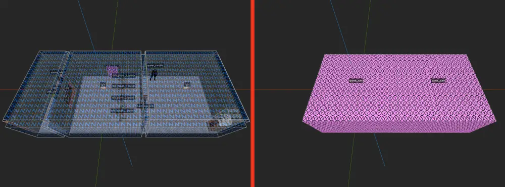
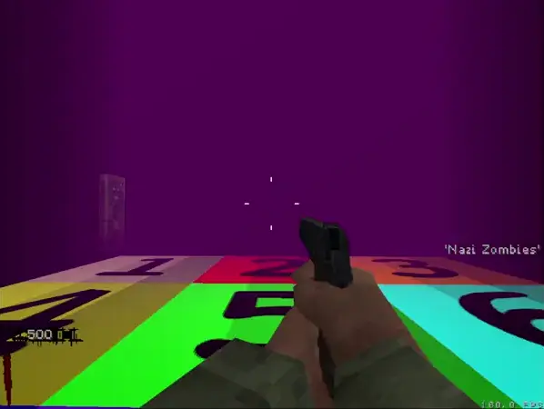

% Zoning - NZ:P Mapping Documentation
# Zoning

## Introduction

In _Nazi Zombies: Portable_ map makers can divide their maps into specific _Zones_ to control the flow of AI spawning as well as some game visual alteration. _Zones_ are placed in a map via a `spawn_zone` brush entity and are then built into a custom file format as part of a map compilation step.

Zones are player specific, so if two clients are across the map from one another, AI will spawn in player one's zone, player one's zone's adjacent zones, player two's zone, player two's zone's adjacent zones.

A map can have a maximum of 32 Zones, consisting of 8 brushes per Zone brush entity. It is expected a Map uses rectangular brushes to build their zones, complex (clipped) shapes are unsupported and their behavior undefined.

## Zone Fields

Fields for a Zone are broken down below.

### Zone Name (`zone_name`)

This is a human-readable string name you supply for the Zone, avoid using spaces. This is how you will reference the Zone when defining Adjacent Zones.

### Adjacent Zones (`adjacent_zones`)

Comma-separated list of Zone names "adjacent" to this one. When a client is inside of this Zone, AI will spawn both inside of it and inside of all adjacent Zones listed. For this reason, adjacent could not be literal for the sake of spawn control. You can have a maximum of **8** adjacent Zones.

### Zone Target (`zone_target`)

This is the `targetname` that all AI that you want to spawn inside the Zone to have. Only one `zone_target` field is supported, so **all AI should share the same `targetname`!**

### Fog Value (`fog`)

Zones support unique `fog` values. This can faciliate various visual enhancements such as pseudo-volumetric fog, where fog can be specific to certain areas of the map but not others. See [fog](fog.md) for details on field specifications.