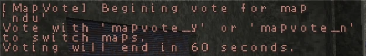

% Map Rotation & Voting - NZ:P Mapping Documentation
# Map Rotation & Voting

__NOTE: This guide uses the terms "level" and "map" interchangeably.__

## Introduction

Nazi Zombies: Portable supports Map Rotation as well as in-game Map Voting for server hosters to provide a selection of maps to clients automatically, as opposed to forcing manual map selection and map repetition.

## Means of Map Changing

### Map Voting

`sv_enablechatplugins` is required to allow for map voting on your server.

Users can use the `mapvote <mapname>` chat command to vote to issue a `changelevel` after the vote duration and grace period. Issuing this command will alert all clients in the server of a request to change levels, and how they can use `mapvote_y` or `mapvote_n` to vote on the decided level. Votes are public.

Votes last 60 seconds, and provided a vote passes, a 15 second wait is in place before the change of level. There is no limit on the amount of votes users can start, but only one can be active at a time.

Votes take priority over map rotation settings.



### Map Rotation

Nazi Zombies: Portable supports three modes of Map Rotation, controlled via the `sv_maprotationmode` cvar:

```
0 : Do Not Rotate
1 : Fixed Map Rotation
2 : Random Map Rotation
```

#### Do Not Rotate

Rotation mode `0` disables map rotation, the currently loaded level will begin again.

#### Fixed Map Rotation

Rotation mode `1` picks linearly from a list of rotations from a plain text (`.txt`) file in the `nzp/` directory. The basename is controlled by `sv_maprotationbasename` (by default it is `map_rotation`). The contents should only be the raw (`.bsp`) names for the levels you want to rotate. For example, to switch between *Warehouse (Classic)* and *Warehouse*, your rotation file would look like so:

```
nzp_warehouse
nzp_warehouse2
```

If a rotation file is not found, the *Random Map Rotation* (`2`) setting will be used instead.

#### Random Map Rotation

Rotation mode `2` chooses a random map from the server's installed maps.